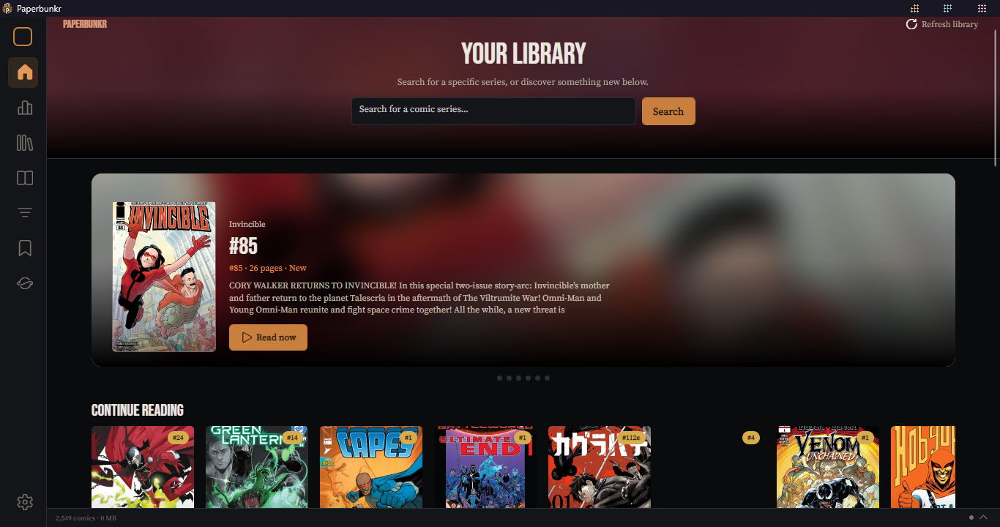
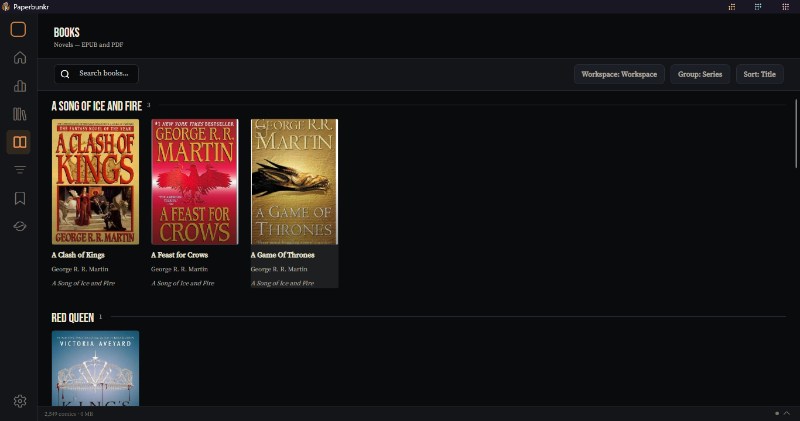
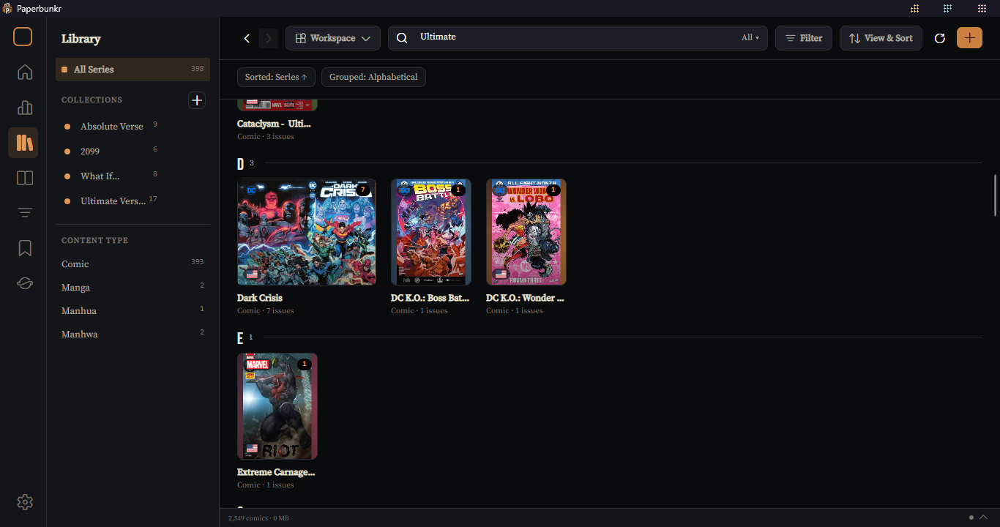
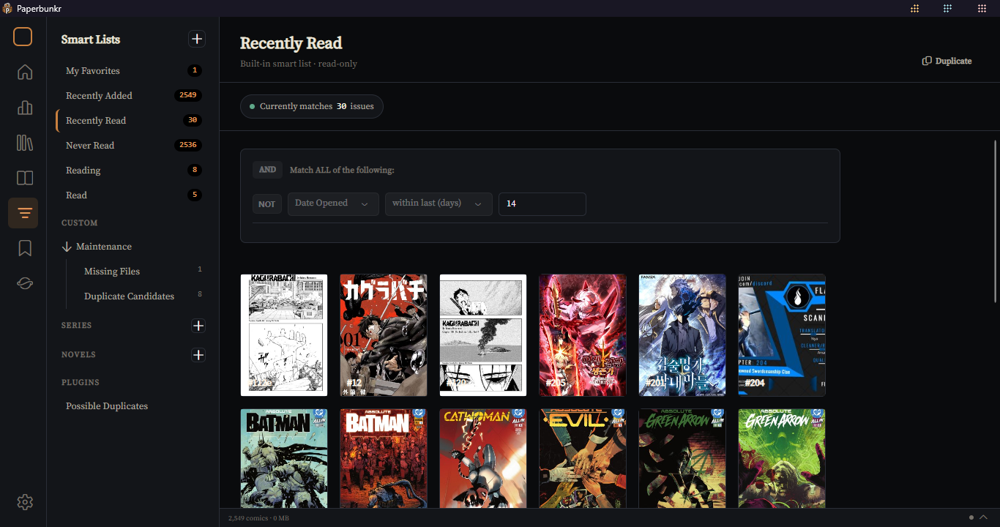
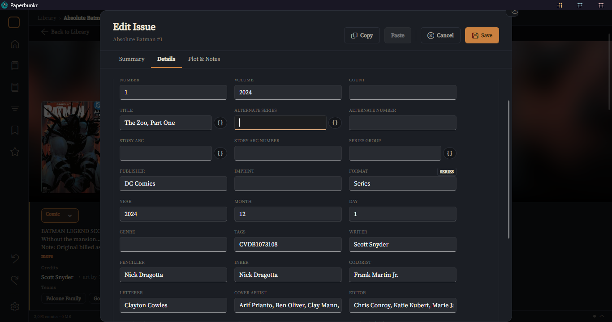
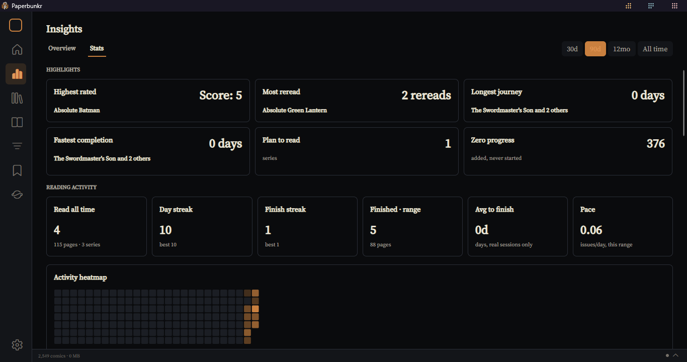
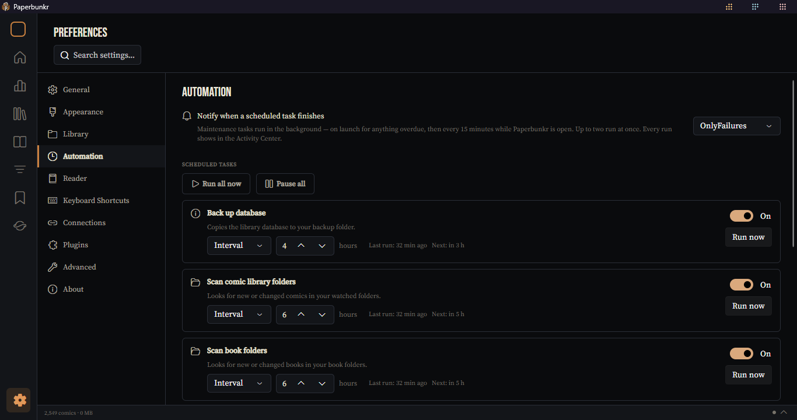
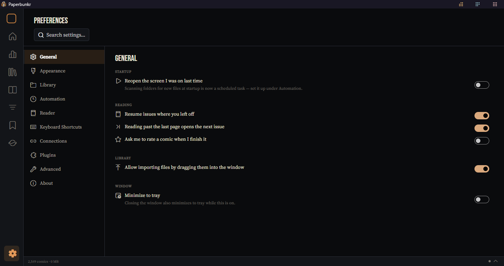

<p align="center">
  
  <br>
  <em>A local-first desktop comic &amp; manga library and reader — a ground-up rewrite of ComicRack.</em>
</p>

<div align="center">

  [](https://github.com/heisehis/PaperBunkr/releases/latest)
  [](https://github.com/heisehis/PaperBunkr/releases)
  [](LICENSE)
  [](https://github.com/heisehis/PaperBunkr/releases/latest)
  [](https://avaloniaui.net/)

</div>

**Paperbunkr** is a free, local-first desktop library and reader for comics and manga — a
from-scratch rewrite of [ComicRack](https://en.wikipedia.org/wiki/ComicRack) built on .NET and
Avalonia UI, currently packaged for Windows. It reads CBZ, CBR, and PDF comics, and EPUB, PDF,
FB2, and MOBI/AZW3 books, with a full library manager, a custom reader, rich metadata editing,
and an installable plugin ecosystem.

Your library, reading progress, and settings never leave your machine. There is no cloud
dependency, no account, and no client-server model like Komga or Kavita — Paperbunkr is a
desktop app that points at folders of files you already own and keeps a local SQLite database
alongside them.

The project aims for **ComicRack CE feature parity plus deliberate, modern deviations** —
Tachiyomi/Mihon-inspired manga handling, a relationship-aware recommendation engine, a
reading-habit dashboard, and a reworked reader among them. It is a solo project and is currently
in **beta**: expect rough edges, and keep backups of anything you point it at.

> Migrating from ComicRack CE? Paperbunkr imports an existing CE library — see
> [Importing from ComicRack CE](https://github.com/heisehis/PaperBunkr/wiki/Importing-from-ComicRack-CE).

<p align="center">
  
</p>

---

## Recent Highlights (September 2026)

The [`0.3.0-beta`](https://github.com/heisehis/PaperBunkr/releases/tag/v0.3.0-beta) release is
the largest since the alpha. The biggest things to be aware of:

* **Insights & Stats.** A new "Insights" section in the nav rail with a reading-habit dashboard
  and a library/reading analytics view, both backed by an append-only log of your reading
  activity (existing progress is backfilled on first launch).
* **Quick Open (`Ctrl+P`).** A command palette to jump to any screen, series, or action by
  typing — the fastest way around the app.
* **Activity Center.** A status bar with a pop-out panel that shows background jobs (scans, cover
  work, scheduled tasks) and surfaces alerts in one place.
* **Library Health & Automation.** A Preferences dashboard that finds missing files, flags
  likely duplicates, and collects everything needing attention into a single "Needs Review"
  list — plus scheduled background maintenance (rescans, cover verification, backups, and more)
  you control from Preferences → Automation.
* **Virtual Tags & Saved Workspaces.** Rule-based tags that apply themselves to matching issues,
  and named snapshots of a full Library or Books view (filters, sort, grouping, columns) you can
  restore in one click.
* **FB2 and MOBI/AZW3 books.** Both formats now import and read alongside EPUB and PDF, and the
  Books/PDF reader was rebuilt around a reflow renderer with a shared reading HUD, in-text
  highlights and notes, and accessibility support.
* **More trackers.** MangaUpdates, MangaDex, and Kitsu join AniList and MangaBaka, with optional
  two-way sync that can push your progress and ratings back to a provider.
* **Drag-and-drop import & metadata write-back.** Drop files, folders, or `.cbl` lists onto the
  Library or a Reading List to import them; optionally write your metadata edits back into the
  comic file as `ComicInfo.xml` and/or a JSON sidecar (off by default).
* **Python plugin commands.** Plugins can now script commands in Python alongside the existing
  plugin API, which also gained new UI extension points and bulk operations. **Duplicate Finder**
  ships as a built-in installable plugin.
* **A faster, quieter app.** Every Library view mode is virtualized (large libraries use far
  less memory and scroll smoothly), the reader's decode/cache/prefetch pipeline was rebuilt,
  startup no longer blocks on the library load, and navigation between screens is animated
  throughout. Preferences was reorganized around a tile-based hub.
* **Redesigned installer and first-run.** Brand artwork, a combined license + terms page,
  per-format file-association checkboxes, a branded startup splash, a reworked Welcome screen,
  and a "What's New" panel on first launch of a new version.

Full history is in [CHANGELOG.md](CHANGELOG.md).

---

## Table of Contents

- [Recent Highlights](#recent-highlights-september-2026)
- [Features](#features)
  - [Comic & Manga Reading](#comic--manga-reading)
  - [Books (EPUB, PDF, FB2, MOBI)](#books-epub-pdf-fb2-mobi)
  - [Library Management](#library-management)
  - [Home Dashboard & Recommendations](#home-dashboard--recommendations)
  - [Smart Lists & Reading Lists](#smart-lists--reading-lists)
  - [Metadata & Editing](#metadata--editing)
  - [Story Events & Continuity](#story-events--continuity)
  - [Insights](#insights)
  - [Library Health & Automation](#library-health--automation)
  - [Plugins](#plugins)
  - [Preferences & Appearance](#preferences--appearance)
  - [Migrating from ComicRack CE](#migrating-from-comicrack-ce)
- [Installation & Build](#installation--build)
- [Known Limitations (beta)](#known-limitations-beta)
- [Documentation](#documentation)
- [Contributing & License](#contributing--license)
- [Acknowledgements](#acknowledgements)

---

## Features

### Comic & Manga Reading

A custom reader canvas with real page decoding and rendering for `.cbz` / `.cbr` / `.pdf` — no
webview anywhere.

<!-- screenshot TODO: the comic reader on a real page with the reader chrome/overlay visible
     (top bar + page controls). Double-page spread is a good choice. Save as docs/assets/reader-comic.png
     then replace this comment with:
<p align="center"></p>
-->


* **Layouts & fit.** Single page, double-page spread, and continuous / webtoon scroll; fit-to-width,
  fit-to-height, fit-screen, and original-resolution modes; zoom presets and free zoom; page
  rotation and per-page rotation overrides.
* **Reading direction.** Left-to-right and right-to-left (manga) page turning, with settings
  remembered per series.
* **Motion & chrome.** Page-turn transitions, auto-scroll, fullscreen with auto-hiding overlays,
  an on-screen clock and battery indicator, and tap-to-toggle chrome on touch.
* **Live image adjustment.** Brightness, contrast, saturation, and gamma overlays independent of
  your display settings, plus background colour and margin customization.
* **Navigation.** Split-page part-by-part navigation for oversized pages, named bookmarks,
  remappable keyboard shortcuts, and a rebuilt decode/cache/prefetch pipeline that keeps
  fast-flipping smooth and memory bounded (`Ctrl+Shift+P` shows a performance overlay).

### Books (EPUB, PDF, FB2, MOBI)

A separate Books section for novels, sitting alongside the comic library.

<p align="center">
  
</p>

<!-- screenshot TODO: the Books reader showing an EPUB in reflow mode with the reading HUD visible,
     ideally with a highlight or note on the page. Save as docs/assets/reader-books.png then add:
<p align="center"></p>
-->


* **Formats.** EPUB, PDF, FB2, and MOBI/AZW3.
* **Reflow reader.** A dedicated reflow renderer for EPUB with a shared reading HUD.
* **Annotations.** In-text highlights and notes.
* **Accessibility.** Screen-reader and keyboard support in the Books reader.
* **Home integration.** A "Continue Reading — Books" shelf on the Home dashboard.

### Library Management

<p align="center">
  
</p>

* **Browsing.** Series and per-issue views, multiple view modes (grid, panorama, details list,
  and more), all virtualized so large libraries stay responsive.
* **Panorama.** Shows every cover at its true shape — portrait, landscape, or square — without
  decoding every image up front.
* **Collections.** Group series, issues, and books by hand, or with rule-based Smart Collections,
  browsable from the Library sidebar.
* **Sort, group & filter.** A unified pool of sort and group keys, filter chips, and a View &
  Sort panel; **Saved Workspaces** capture a whole configuration by name.
* **Virtual Tags.** Rule-based tags that apply themselves to matching issues.
* **Navigation.** Full keyboard movement through every grid and sidebar, Back/Forward screen
  history, and **Quick Open** (`Ctrl+P`) to jump anywhere by typing.
* **Import.** Folder scanning with trade-paperback folding and anthology auto-splitting, plus
  drag-and-drop of files, folders, and `.cbl` lists onto the Library.

### Home Dashboard & Recommendations

A cover-forward dashboard driven by a relationship-aware recommendation engine.

* **Continue Reading** for comics and books, tracking your exact page.
* **"Because you read…"** recommendations that follow series relations, shared creators,
  continuity, and story events.
* **Spotlight** modules with a blurred cover-wall masthead that picks up the featured book's
  colour and the active theme.

### Smart Lists & Reading Lists

<p align="center">
  
</p>

* **Smart Lists v2.** Saved rule-based views with nested AND/OR condition groups and text
  operators (list-contains, regex, case sensitivity) — a CE-parity rule engine.
* **Reading Lists.** Hand-curated ordered lists, with drag-and-drop reordering and bulk actions.
* **Import / export.** ComicBookList (`.cbl`) and CSV, with story-arc lookup across multiple
  sources to auto-build an event's reading order from files you already own.

### Metadata & Editing

<p align="center">
  
</p>

* **Editors.** Single-issue and bulk multi-issue property editors with a save/cancel edit buffer,
  autocomplete, dropdowns, and steppers that match ComicRack's editing feel.
* **Per-page.** Page type and rotation overrides, copy/paste of metadata, a token editor, and
  undo/redo.
* **Canonical model.** Series relations, continuity groupings, story events, media relations, and
  external links — a full metadata platform underneath the editors.
* **Online lookups.** Link external metadata from AniList, MangaBaka, MangaUpdates, MangaDex,
  Kitsu, and more as per-field proposals you accept or reject, with optional two-way sync of
  progress and ratings. Bring your own [ComicVine](COMICVINE_NOTICE.md) API key for ComicVine
  lookups.
* **Write-back.** Optionally embed your edits into the file as `ComicInfo.xml` and/or a
  `paperbunkr.json` sidecar (opt-in, `.cbz` only).

### Story Events & Continuity

* Bulk selection, continuity editing and merging, and cross-event relations.
* Format-signal grouping suggestions.
* An age / appearance timeline for tracking a character or continuity across events.

### Insights

<p align="center">
  
</p>

* A **reading-habit dashboard** in the nav rail.
* A **Stats** view with library and reading analytics (ScottPlot charts).
* Both backed by an append-only `ReadingEvent` log; your existing progress is backfilled once on
  upgrade.

### Library Health & Automation

<p align="center">
  
</p>

* **Library Health.** A Preferences dashboard that finds missing files, flags likely duplicates,
  and collects everything needing attention into a single "Needs Review" list.
* **Automation.** Background maintenance tasks — library rescan, cover verification, database
  backups, and more — each on a schedule you control from Preferences → Automation, with an
  activity history.
* **Activity Center.** A status bar and pop-out panel showing running jobs and alerts.

### Plugins

* An **installable plugin ecosystem** with its own package manager in Preferences → Plugins.
* A plugin API for reading metadata, running rules, and writing changes under user confirmation,
  with UI extension points (a ComicInfo editor tab, Quick Open entries, thumbnail overlays) and
  bulk operations.
* **Python plugin commands** alongside the existing API.
* **Duplicate Finder** ships as a built-in installable plugin.

### Preferences & Appearance

<p align="center">
  
</p>

* **Preferences** organized into General, Appearance, Library (with Library Health, Folder
  Management, and Virtual Tags), Automation, Reader, Keyboard Shortcuts, Connections, Plugins,
  Advanced, and About — every area reworked around a tile-based layout.
* A runtime **skin/theme system** with light and dark themes.
* Publisher, service, format, age-rating, and language **iconography** across library, detail,
  and metadata screens.
* **Database backups** (scheduled and automatic), a corrupted-database recovery flow, and
  crash-safe WAL mode.
* **Auto-update** — Paperbunkr checks for new releases on startup (and on demand from
  Preferences → About) and can download and apply updates in-app.

### Migrating from ComicRack CE

Paperbunkr imports an existing ComicRack CE library — database, reading state, lists, and
embedded metadata — with series-identity matching and CE-compatible metadata precedence. See the
[migration guide](https://github.com/heisehis/PaperBunkr/wiki/Importing-from-ComicRack-CE).

---

## Installation & Build

### Install a build

Grab the installer from the [latest release](https://github.com/heisehis/PaperBunkr/releases/latest)
and run it. It is fully self-contained — it bundles its own .NET runtime, so there is nothing else
to install. Windows only for now. Paperbunkr checks for new releases on startup and can update
itself in-app.

### Build from source

Requires the [.NET 10 SDK](https://dotnet.microsoft.com/download/dotnet/10.0).

```bash
dotnet build Paperbunkr.sln
dotnet run --project src/Paperbunkr.App/Paperbunkr.App.csproj
```

To build a Windows installer yourself (requires [Inno Setup 6](https://jrsoftware.org/isdl.php)):

```powershell
pwsh installer/BuildInstaller.ps1
```

More detail — architecture, project layout, and Phase 0 findings — is in
[docs/onboarding.md](docs/onboarding.md).

---

## Known Limitations (beta)

- **Windows only** for now. Cross-platform (macOS / Linux) is a later-phase goal, not a v1
  requirement.
- **No cloud sync** — this is by design, not a gap, but worth knowing up front.
- **No content downloading.** Paperbunkr enriches and reads files you already own; a
  Tachiyomi-style source/extension system for fetching chapters from external sites is
  deliberately out of scope.
- This is a **solo beta project**. Things move fast, screens and wording change often, and bugs
  happen — [reports are genuinely welcome](https://github.com/heisehis/PaperBunkr/issues).

---

## Documentation

The [project wiki](https://github.com/heisehis/PaperBunkr/wiki) covers day-to-day use:

- [Getting Started](https://github.com/heisehis/PaperBunkr/wiki/Getting-Started)
- [The Library](https://github.com/heisehis/PaperBunkr/wiki/The-Library) ·
  [Reading](https://github.com/heisehis/PaperBunkr/wiki/Reading) ·
  [Keyboard Shortcuts](https://github.com/heisehis/PaperBunkr/wiki/Keyboard-Shortcuts)
- [Smart Lists](https://github.com/heisehis/PaperBunkr/wiki/Smart-Lists) ·
  [Reading Lists](https://github.com/heisehis/PaperBunkr/wiki/Reading-Lists) ·
  [Books (EPUB & PDF)](https://github.com/heisehis/PaperBunkr/wiki/Books-EPUB-and-PDF)
- [Metadata & Editing](https://github.com/heisehis/PaperBunkr/wiki/Metadata-and-Editing) ·
  [Preferences](https://github.com/heisehis/PaperBunkr/wiki/Preferences) ·
  [Plugins](https://github.com/heisehis/PaperBunkr/wiki/Plugins)
- [Importing from ComicRack CE](https://github.com/heisehis/PaperBunkr/wiki/Importing-from-ComicRack-CE) ·
  [Troubleshooting](https://github.com/heisehis/PaperBunkr/wiki/Troubleshooting)

---

## Contributing & License

This is primarily a solo project, but external contributions are welcome — see
[CONTRIBUTING.md](CONTRIBUTING.md) for the (lightweight) contributor license terms and
[.github/ISSUE_TEMPLATE](.github/ISSUE_TEMPLATE) / [.github/PULL_REQUEST_TEMPLATE.md](.github/PULL_REQUEST_TEMPLATE.md)
for how to open issues and PRs. Bug reports and feedback are genuinely welcome via
[GitHub Issues](https://github.com/heisehis/PaperBunkr/issues).

Paperbunkr is licensed under the [GNU Affero General Public License v3.0](LICENSE) (AGPLv3). See
also [PRIVACY.md](PRIVACY.md) (how the app handles data and third-party API calls),
[TERMS.md](TERMS.md) (usage terms and warranty disclaimer), and
[COMICVINE_NOTICE.md](COMICVINE_NOTICE.md) (guidance on using your own ComicVine API key). These
are living documentation templates, not a substitute for your own legal review if you redistribute
or operate a modified instance.

---

## Acknowledgements

Paperbunkr stands on a lot of prior work:

* **[ComicRack](https://en.wikipedia.org/wiki/ComicRack)** and the
  **[ComicRack Community Edition](https://github.com/maforget/ComicRackCE)** project — the
  original this is a rewrite of, and the reference for feature parity. See
  [docs/onboarding.md §2](docs/onboarding.md) for the provenance and licensing notes.
* **[Avalonia UI](https://avaloniaui.net/)** — the cross-platform .NET UI framework the whole app
  is built on.
* **[CommunityToolkit.Mvvm](https://learn.microsoft.com/dotnet/communitytoolkit/mvvm/)**,
  **[Entity Framework Core](https://learn.microsoft.com/ef/core/)** + **SQLite**,
  **[ScottPlot](https://scottplot.net/)**, **[Svg.Skia](https://github.com/wieslawsoltes/Svg.Skia)**,
  and **[FluentIcons](https://github.com/davidxuang/FluentIcons)**.
* **[AniList](https://anilist.co/)**, **[MangaBaka](https://mangabaka.dev/)**,
  **[MangaUpdates](https://www.mangaupdates.com/)**, **[MangaDex](https://mangadex.org/)**,
  **[Kitsu](https://kitsu.io/)**, and **[ComicVine](https://comicvine.gamespot.com/)** — the
  metadata sources behind online lookups and tracking.
* **[Inno Setup](https://jrsoftware.org/isinfo.php)** — the Windows installer.
* **[Tachiyomi](https://tachiyomi.org/) / [Mihon](https://mihon.app/)** — inspiration for the
  manga library and reading model.

Built with heavy AI assistance from **Claude (Anthropic)**.
